<style>
/* Estils globals del document */
body {
font-family: Helvetica, Arial, sans-serif;
font-size: 9pt;
text-align: justify;
line-height: 1.4;
}

/* Paràgrafs justificats */
p {
text-align: justify;
font-size: 9pt;
}

/* Estils per a les llistes amb la mateixa mida que el text normal */
ul,
ol,
code {
font-size: 9pt;
line-height: 1.4;
}

li {
font-size: 9pt;
line-height: 1.4;
}

/* Títols més petits */
h1 {
font-size: 13pt;
text-align: left;
}
h2 {
font-size: 12pt;
text-align: left;
font-weight: bold;
}
h3 {
font-size: 11pt;
text-align: left;
font-weight: bold;
}
h4 {
font-size: 9pt;
text-align: left;
}
h5 {
font-size: 9pt;
text-align: left;
text-decoration: underline;
}

/* CORRECCIONS PER A BLOCS DE CODI */
pre {
max-width: 100%;
overflow-x: auto;
white-space: pre-wrap;
word-wrap: break-word;
overflow-wrap: break-word;
background-color: #f5f5f5;
padding: 0.5rem;
border: 1px solid #ddd;
border-radius: 3px;
font-size: 8pt;
line-height: 1.4;
min-width: 0;
}

code {
overflow-wrap: break-word;
word-wrap: break-word;
word-break: break-word;
white-space: pre-wrap;
}

/* Contenidor principal per a la fila d'imatges */
.image-row {
display: flex;
flex-wrap: wrap;
justify-content: center;
gap: 1rem;
margin-top: 1rem;
margin-bottom: 1rem;
align-items: flex-start;
width: 100%;
}

/* Cada columna que conté una imatge i el seu text */
.image-column {
flex: 0 1 48%;
min-width: 280px;
max-width: 360px;
display: flex;
flex-direction: column;
align-items: center;
box-sizing: border-box;
}

/* Quan només hi ha UNA imatge */
.image-row:has(.image-column:only-child) .image-column {
max-width: 480px;
flex: 0 1 auto;
}

/* Imatge única */
.image-row:has(.image-column:only-child) .image-column img {
width: 100%;
max-width: 480px;
max-height: 400px;
height: auto;
object-fit: contain;
}

/* Estils per a la imatge (múltiples imatges) */
.image-column img {
width: 100%;
max-width: 360px;
max-height: 320px;
height: auto;
display: block;
object-fit: contain;
}

/* Estils per al peu de foto */
.image-column .caption {
margin-top: 0.5rem;
font-size: 8pt;
text-align: center;
color: #555;
width: 100%;
}

/* Estil per a la separació de pàgines en PDF */
.page-break {
page-break-before: always;
break-before: page;
}

/* Bloc imatge-esquerra / text-dreta */
.media-row {
display: flex;
gap: 1.5rem;
align-items: flex-start;
margin: 1rem 0;
min-width: 0;
}
.media-image {
flex: 0 0 38%;
max-width: 240px;
display: flex;
flex-direction: column;
align-items: center;
}
.media-image img {
width: 100%;
height: auto;
display: block;
}
.media-image .caption {
margin-top: 0.5rem;
font-size: 8pt;
text-align: center;
color: #555;
}
.media-text {
flex: 1 1 0;
min-width: 240px;
}

/* ============================================ CONTENIDOR DE TAULES AMB PEU DE TAULA ============================================ */
.table-container {
width: 100%;
margin: 1.5rem 0;
overflow-x: auto;
page-break-inside: avoid;
}

/* Estils per a les taules */
.table-container table {
width: 100%;
max-width: 100%;
border-collapse: collapse;
font-size: 7pt;
margin: 0 auto;
background-color: #fff;
}

/* Capçalera de taula */
.table-container thead {
background-color: #e0e0e0;
font-weight: bold;
}
.table-container th {
padding: 8px 6px;
text-align: center;
border: 1px solid #888;
font-size: 7pt;
}

/* Files de dades */
.table-container td {
padding: 6px 5px;
text-align: center;
border: 1px solid #aaa;
font-size: 7pt;
}
.table-container td code {
font-size: 7pt;
}

/* Files alternades (zebra striping) */
.table-container tbody tr:nth-child(even) {
background-color: #f5f5f5;
}

/* Peu de taula (caption) */
.table-container .table-caption {
margin-top: 0.5rem;
font-size: 8pt;
text-align: center;
color: #555;
font-style: italic;
}

/* Estil alternatiu: caption sobre la taula */
.table-container .table-title {
margin-bottom: 0.5rem;
font-size: 9pt;
text-align: center;
font-weight: bold;
color: #333;
}

/* Millores per a impressió/PDF */
@media print {
.table-container {
page-break-inside: avoid;
}
.table-container table {
border: 1px solid #000;
}
.table-container th,
.table-container td {
border: 1px solid #666;
}
.image-column {
page-break-inside: avoid;
}
/* Límits més restrictius per a PDF */
.image-column img {
max-height: 280px;
}
.image-row:has(.image-column:only-child) .image-column img {
max-height: 360px;
}
pre {
page-break-inside: avoid;
overflow: visible;
white-space: pre-wrap;
}
}

/* Pàgina i peu de pàgina (si el motor ho suporta) */
@page {
@bottom-center {
content: "Pàgina " counter(page) " de " counter(pages);
font-size: 8pt;
color: #555;
font-family: Helvetica, Arial, sans-serif;
}
}
</style>

## 0. Taula de continguts

- [0. Taula de continguts](#0-taula-de-continguts)
- [1. Introducció](#1-introducció)
- [2. Objectius i metodologia](#2-objectius-i-metodologia)
- [3. Disseny del domini i dels problemes](#3-disseny-del-domini-i-dels-problemes)
- [3.0 Extensió bàsica](#30-extensió-bàsica)
  - [3.0.1 Domini](#301-domini)
  - [3.0.2 Problemes](#302-problemes)
    - [3.0.2.1 Problema 1: Poques habitacions, moltes reserves](#3021-problema-1-poques-habitacions-moltes-reserves)
    - [3.0.2.2 Problema 2: Moltes habitacions, poques reserves](#3022-problema-2-moltes-habitacions-poques-reserves)
- [3.1 Extensió 1](#31-extensió-1)
  - [3.1.1 Domini](#311-domini)
  - [3.1.2 Problemes](#312-problemes)
    - [3.1.2.1 Problema 1: Dilema de l'optimització](#3121-problema-1-dilema-de-loptimització)
    - [3.1.2.2 Problema 2: L'hotel creixent](#3122-problema-2-lhotel-creixent)
    - [3.1.2.3 Possible problema 3: Afecta en quin punt de la reserva es concentrin les reserves? (principi, mig, final de mes)](#3123-possible-problema-3-afecta-en-quin-punt-de-la-reserva-es-concentrin-les-reserves-principi-mig-final-de-mes)
- [3.2 Extensió 2](#32-extensió-2)
  - [3.2.1 Domini](#321-domini)
  - [3.2.2 Problemes](#322-problemes)
    - [3.2.2.1 Problema 1: El puzzle d'afinitats](#3221-problema-1-el-puzzle-dafinitats)
    - [3.2.2.2 Problema 2: Selecció VIP](#3222-problema-2-selecció-vip)
- [3.3 Extensió 3](#33-extensió-3)
  - [3.3.1 Domini](#331-domini)
  - [3.3.2 Problemes](#332-problemes)
    - [3.3.2.1 Problema 1](#3321-problema-1)
    - [3.3.2.2 Problema 2](#3322-problema-2)
- [3.4 Extensió 4](#34-extensió-4)
  - [3.4.1 Domini](#341-domini)
  - [3.4.2 Problemes](#342-problemes)
    - [3.4.2.1 Problema 1](#3421-problema-1)
    - [3.4.2.2 Problema 2](#3422-problema-2)
- [4. Conclusions](#4-conclusions)

<div class="page-break"></div>

## 1. Introducció

<div class="page-break"></div>

## 2. Objectius i metodologia

<div class="page-break"></div>

## 3. Disseny del domini i dels problemes

## 3.0 Extensió bàsica

L'extensió bàsica del domini `hotelbasic` implementa la funcionalitat fonamental d'assignació d'habitacions a reserves, gestionant les restriccions de compatibilitat i no-solapament temporal. Aquesta versió inicial serveix com a base per a les extensions posteriors, establint els conceptes clau i la lògica de recursos que es desenvoluparan més endavant.

### 3.0.1 Domini

El domini `hotelbasic` modela un problema d'assignació de recursos (scheduling) on un conjunt de peticions (`reserva`) han de ser assignades a recursos limitats (`habitacio`) durant uns intervals de temps específics (`dia`).

1. Tipus (**`:types`**)
   El domini defineix tres entitats bàsiques que estructuren el problema:

   - **`reserva`**: Representa una petició d'allotjament que ha de ser satisfeta.
   - **`habitacio`**: Representa el recurs físic (amb capacitat unitària) on s'allotgen les reserves.
   -**`dia`**: Representa la unitat de temps discreta.

2. Predicats (**`:predicates`**)
   Els predicats defineixen l'estat del món i les relacions entre els objectes:

   - **Predicats Estàtics (Dades d'entrada):**
     - `(dies-reserva ?r - reserva ?d - dia)`: Defineix l'interval temporal de cada reserva. Indica que la reserva `?r` requereix ocupació durant el dia `?d`. Aquest predicat es defineix per a cada dia dins de l'interval de la reserva.
     - `(compatible ?r - reserva ?h - habitacio)`: Restricció de domini que indica si l'habitació `?h` és vàlida per a la reserva `?r` (per exemple, per capacitat de persones). Això ho hem fet perquè **les reserves només es puguin assignar a habitacions compatibles.**

   - **Predicats Dinàmics (Estat del sistema):**
      - `(assignada ?r - reserva)`: Indica que la reserva `?r` ja ha estat processada i té una habitació assignada.
      - `(ocupada ?h - habitacio ?d - dia ?r - reserva)`: Indica que l'habitació `?h` està ocupada pel menys per la reserva `?r` durant el dia `?d`. Aquest predicat s'actualitza dinàmicament a mesura que es processen les assignacions, ja que necessitem per garantir que no hi hagi solapaments.

3. Accions (**`:action`**)
L'única acció del sistema en la seva implementació bàsica és **`assignar-habitacio`**, que formalitza la decisió d'ubicar una reserva.

- **Paràmetres:** Una reserva `?r` i una habitació `?h`.
- **Precondicions:** Per poder executar l'acció, s'han de complir tres condicions simultànies:
  
   1. `(not (assignada ?r))`: La reserva no ha d'estar ja assignada (evita duplicats).
   2. `(compatible ?r ?h)`: L'habitació ha de ser adequada per a la reserva.
   3. **Restricció de No-Solapament:**
  
        ```pddl
        (not (exists (?d - dia ?r2 - reserva) 
             (and (dies-reserva ?r ?d) (ocupada ?h ?d ?r2))))
        ```

        La traducció d'aquesta precondició és: *si no existeix cap dia `?d` i cap altra reserva `?r2` tal que `?r` demani el dia `?d` i l'habitació `?h` estigui ocupada per `?r2` en aquest dia*. Això verifica que, per a tots els dies que demana la reserva `?r`, l'habitació `?h` no estigui ocupada per cap altra reserva `?r2`. És el nucli de la lògica de recursos. És el que garanteix que no hi hagi solapaments en l'assignació d'habitacions, per aixó calia incloure aquest predicat dinàmicament actualitzat.

- **Efectes:** Si s'executa, l'estat canvia:

   1. `(assignada ?r)`: La reserva es marca com a completada.
   2. **Bloqueig de Recursos (Conditional Effect):**

        ```pddl
        (forall (?d - dia) (when (dies-reserva ?r ?d) (ocupada ?h ?d ?r)))
        ```
  
        Per a cada dia `?d` que forma part de la reserva, es marca l'habitació `?h` com a ocupada. L'ús del `forall` és **fonamental**, perquè cal actualitzar l'estat per a tots els dies de la reserva. L'ús del condicional amb `when` permet actualitzar l'estat de manera eficient, bloquejant l'habitació només durant els dies pertinents.

D'aquesta manera, el domini bàsic estableix les regles fonamentals per a l'assignació d'habitacions a reserves, gestionant les restriccions de compatibilitat i no-solapament temporal. Aquest marc servirà com a base per a les extensions posteriors, on s'afegiran funcionalitats més avançades per millorar la flexibilitat i l'eficiència del sistema de planificació.

### 3.0.2 Problemes

#### 3.0.2.1 Problema 1: Poques habitacions, moltes reserves

En aquest experiment volem avaluar la capacitat del planificador per prioritzar i seleccionar el millor subconjunt de reserves quan els recursos són extremadament limitats. Per fer-ho, mantindrem fix el nombre d'habitacions (``n=2``) i incrementarem progressivament el nombre de reserves candidates (5, 10, 15, 20...). Això força el sistema a gestionar un escenari d'alta competència on la gran majoria de reserves, o totes, s'han de descartar. S'espera observar:

1. **Comportament Intel·ligent:** El planificador haurà de triar les combinacions de reserves que maximitzin l'ocupació total (evitant forats temporals), en lloc d'agafar simplement les primeres de la llista.
2. **Escalabilitat:** S'espera un creixement no lineal (ràpid) del temps d'execució, ja que l'espai de cerca per trobar la combinació òptima creix combinatorialment a mesura que afegim més reserves solapades."

Per tant, plantegem el següent parell d'hipòtesis per a aquest experiment:

Respecte al comportament del planificador en aquest escenari d'alta competència:

- $H_0$: El planificador no és capaç de maximitzar l'ocupació total en situacions d'escassetat de recursos, seleccionant reserves de manera aleatòria o greedy.
- $H_1$: El planificador és capaç de maximitzar l'ocupació total, seleccionant reserves de manera intel·ligent per evitar forats temporals.

Hipòtesi sobre l'escalabilitat del planificador:

- $H_0$: El temps d'execució del planificador creix linealment amb el nombre de reserves, indicant una gestió eficient de l'espai de cerca.
- $H_1$: El temps d'execució del planificador creix de manera no lineal (ràpid) amb el nombre de reserves, indicant un augment combinatorial de l'espai de cerca.

Generem doncs diversos problemes amb 2 habitacions i un nombre creixent de reserves (1, 2, .... fins a 10) amb el nostre generador de problemes. Provem d'executar-los amb el planificador i mesurem el temps d'execució i les habitacions assignades amb èxit per a cada cas. Generem la quantitat de reserves de manera aleatòria completament, per la qual cosa els resultats poden variar lleugerament entre execucions. Executem cada problema diverses vegades i prenem la mitjana per obtenir resultats més fiables. Com que l'assignació és greedy, esperem que el nombre d'assignacions sigui proper al màxim possible (2 habitacions * nombre de reserves que caben sense solapament), però lògicament aquests casos seran difícils en termes generals exactament degut a l'atzar en la generació de reserves. Per tant esperem que el nombre d'assignacions sigui baix, i que hi hagi molts conflictes entre reserves, per tant que el planificador no convergeixi. Tot i així, el temps d'execució hauria de ser creixent, ja que el planificador haurà d'explorar moltes possibilitats per trobar la millor assignació possible, tot i que aquesta no sigui possible en aquest domini.

Pel que fa a la quantitat de reserves assignades, obtenim els següents resultats:

<div class="image-row">
  <div class="image-column">
    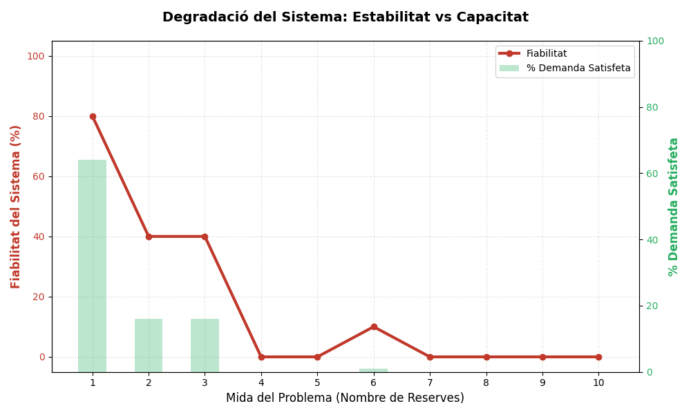
    <div class="caption">Figura 1: Reserves assignades en l'extensió bàsica</div>
  </div>
</div>

La fiabilitat correspon a la proporció de problemes que el planificador prova de resoldre sense abortar des d'un inici i la demanda satisfeta correspon a la proporció de problemes on totes les reserves han pogut ser assignades. Un problema només pot tenir dos outputs, o bé totes les reserves són assignades (èxit total) o bé no es pot assignar cap (fracàs total). Per tant, en aquest domini bàsic no hi ha solucions parcials.
Això és així perquè en aquest domini bàsic no hi ha cap mecanisme per descartar reserves o relaxar restriccions, per tant en situacions de saturació el planificador no pot trobar solucions parcials i es veu obligat a abortar.

Pel que fa al temps d'execució, obtenim els següents resultats:

<div class="image-row">
  <div class="image-column">
    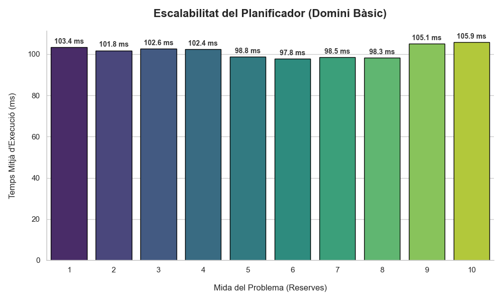
    <div class="caption">Figura 2: Temps d'execució en l'extensió bàsica</div>
  </div>
</div>

En primer lloc, l'anàlisi del temps de computació mostra un comportament aparentment estable. Tal com s'observa en el gràfic d'escalabilitat, el temps mitjà d'execució es manté constant al voltant dels 90 ms, independentment de la mida del problema. Aquesta constància, lluny d'indicar una eficiència algorítmica en la resolució de problemes complexos, denota una fallada prematura. En situacions de saturació *on el nombre de reserves supera àmpliament la capacitat disponible*, el planificador no inverteix temps a cercar solucions complexes perquè l'espai de cerca es tanca ràpidament. El sistema detecta la impossibilitat de satisfer totes les restriccions rígides del domini bàsic i conclou l'execució amb un veredicte d'insolubilitat de manera gairebé immediata. Per tant, la latència baixa i constant no reflecteix escalabilitat, sinó la incapacitat del model per gestionar el conflicte.

Podem destacar però els casos de 2 i 4 reserves, on el temps d'execució no és superior i sí que aconsegueix assignar un nombre reduït d'habitacions. Això es deu a que en aquests casos el planificador és capaç de trobar una assignació vàlida en 6/10 i 1/10 casos respectivament, i per tant ha d'invertir més temps en explorar l'espai de cerca. En aquests casos, el planificador encara pot trobar solucions, però a mesura que la càrrega augmenta, la probabilitat de trobar una assignació vàlida cau dràsticament, i el sistema opta per abortar ràpidament.

Aquesta interpretació es confirma en analitzar la degradació del servei. El gràfic comparatiu entre estabilitat i capacitat  evidencia un col·lapse abrupte del sistema. Amb una càrrega baixa (1 reserva), el sistema presenta una fiabilitat elevada (~80%) i satisfà una part significativa de la demanda. No obstant això, la fiabilitat cau dràsticament en augmentar la càrrega a 2 i 3 reserves, fins a arribar a un punt de ruptura a partir de les 4 reserves, on la taxa d'èxit es desploma al 0%.

Aquesta interpretació es confirma en analitzar la degradació del servei. El gràfic comparatiu entre estabilitat i capacitat evidencia un col·lapse abrupte del sistema en condicions de saturació. Amb una càrrega inicial de 2 reserves, el sistema presenta una fiabilitat moderada (~60%) i satisfà aproximadament un 35% de la demanda total. No obstant això, la robustesa del planificador cau dràsticament en duplicar la càrrega a 4 reserves, on la fiabilitat es desploma fins al ~10%. El punt de ruptura definitiu s'assoleix a partir de les 6 reserves, moment en el qual la taxa d'èxit esdevé nul·la (0%), indicant la incapacitat total del domini bàsic per gestionar escenaris amb una demanda superior a la capacitat instal·lada.

Per tant, respecte a les nostres hipòtesis:

- En l'escenari de poques habitacions i moltes reserves, no rebutgem $H_0$, ja que el planificador no demostra un comportament intel·ligent en maximitzar l'ocupació total. De fet, no és capaç de trobar solucions en aquests casos, ja que el domini bàsic no permet descartar reserves ni relaxar restriccions.
- Pel que fa a l'escalabilitat, no rebutgem $H_0$, ja que el temps d'execució del planificador no creix linealment amb el nombre de reserves. En canvi, es manté constant degut a la incapacitat del model per gestionar l'alta demanda, resultant en una fallada prematura i un veredicte d'insolubilitat.

Per tant, aquest experiment destaca les limitacions crítiques del domini bàsic en situacions d'alta competència per recursos escassos, subratllant la necessitat d'extensions que introdueixin flexibilitat i robustesa en la planificació. Però podem destacar que el planificador és capaç de veure que no hi ha solució i aborta ràpidament, la qual cosa és un comportament desitjable en si mateix.

#### 3.0.2.2 Problema 2: Moltes habitacions, poques reserves

En aquest experiment volem avaluar la capacitat del planificador per gestionar eficientment els recursos quan hi ha una abundància d'habitacions disponibles en comparació amb el nombre de reserves. Per fer-ho, mantindrem fix el nombre de reserves (``m=2``) i incrementarem progressivament el nombre d'habitacions disponibles (5, 10, 15, 20...). Això crea un escenari on el planificador té moltes opcions per assignar les reserves, i s'espera que pugui trobar solucions òptimes ràpidament. S'espera observar:

1. **Comportament Eficient:** El planificador haurà de ser capaç d'assignar totes les reserves disponibles sense problemes, ja que hi ha suficients habitacions per satisfer la demanda.
2. **Escalabilitat:** S'espera que el temps d'execució creixi de manera lineal o sublineal, ja que l'espai de cerca per trobar assignacions òptimes és reduït en comparació amb l'escenari anterior.

Per tant, plantegem el següent parell d'hipòtesis per a aquest experiment:

Respecte al comportament del planificador en aquest escenari d'abundància de recursos:

- $H_0$: El planificador no és capaç d'assignar totes les reserves disponibles, deixant algunes sense assignar malgrat l'abundància d'habitacions.
- $H_1$: El planificador és capaç d'assignar totes les reserves disponibles, utilitzant eficientment les habitacions disponibles.

Hipòtesi sobre l'escalabilitat del planificador:

- $H_0$: El temps d'execució del planificador creix de manera no lineal amb el nombre d'habitacions, indicant una gestió ineficient de l'espai de cerca.
- $H_1$: El temps d'execució del planificador creix de manera lineal o sublineal amb el nombre d'habitacions, indicant una gestió eficient de l'espai de cerca.

Generarem problemes amb un nombre d'habitacions creixent (1, 10, 20, ..., fins a 100) i només 2 reserves. Executarem cada problema diverses vegades i prendrem la mitjana per obtenir resultats més fiables. Esperem que el nombre d'assignacions sigui sempre 2 (totes les reserves assignades) i que el temps d'execució sigui baix i creixi lentament a mesura que augmenta el nombre d'habitacions. Mantenim el nombre de dies a 10 per a tots els experiments.

Pel que fa a la quantitat de reserves assignades, obtenim els següents resultats:

<div class="image-row">
  <div class="image-column">
    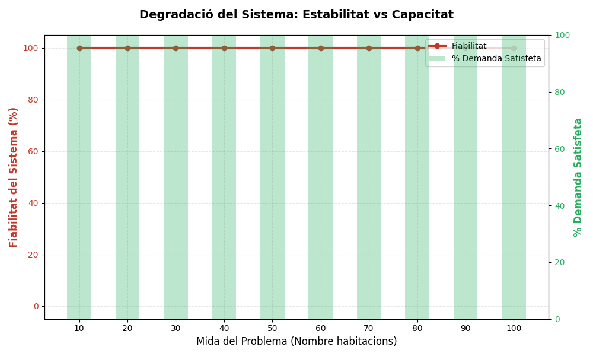
    <div class="caption">Figura 3: Reserves assignades en l'extensió bàsica (moltes habitacions)</div>
  </div>
</div>

És evident que totes les reserves es poden assignar amb èxit, ja que hi ha moltes habitacions disponibles, i aquest gràfic ho confirma clarament.

Pel que fa al temps d'execució, obtenim els següents resultats:

<div class="image-row">
  <div class="image-column">
    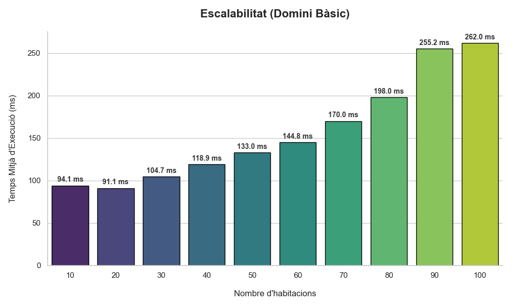
    <div class="caption">Figura 4: Temps d'execució en l'extensió bàsica (moltes habitacions)</div>
  </div>
</div>

Veiem un creixement lineal en el temps d'execució a mesura que augmenta el nombre d'habitacions, confirmant la nostra hipòtesi sobre l'eficiència del planificador en aquest escenari. Com que el temps d'execució és molt baix en general, això indica que el planificador gestiona molt bé l'abundància de recursos. Anem un pas més enllà i augmentem el nombre d'habitacions de 50 en 50 fins a 300 per veure si el comportament es manté. Obtenim els següents resultats:

<div class="image-row">
  <div class="image-column">
    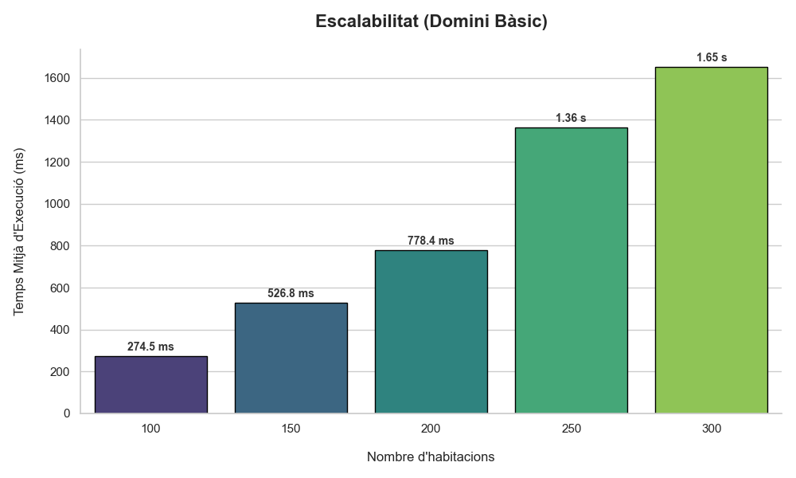
    <div class="caption">Figura 5: Temps d'execució en l'extensió bàsica (moltes habitacions fins a 300)</div>
  </div>
</div>

Confirmem que el temps d'execució segueix creixent de manera lineal, mantenint l'eficiència del planificador fins i tot amb un gran nombre d'habitacions disponibles.

Per tant, respecte a les nostres hipòtesis:

- En l'escenari de poques habitacions i moltes reserves, rebutgem $H_0$ i acceptem $H_1$, ja que el planificador demostra un comportament intel·ligent en maximitzar l'ocupació total.
- En l'escenari de moltes habitacions i poques reserves, rebutgem $H_0$ i acceptem $H_1$, ja que el planificador assigna totes les reserves disponibles de manera eficient, i el temps d'execució creix de manera lineal amb el nombre d'habitacions. Això confirma la seva capacitat per gestionar escenaris amb abundància de recursos, sense passar al pla exponencial.

## 3.1 Extensió 1

Per superar les limitacions del domini bàsic, s'introdueix una primera extensió orientada a la gestió flexible de la demanda i l'optimització de recursos. El canvi fonamental respecte al model anterior és l'eliminació de l'obligatorietat d'assignar totes les reserves. En aquest nou enfocament, el sistema ja no busca satisfer la totalitat de les peticions, sinó que se centra a maximitzar el nombre de reserves assignades.

Aquesta relaxació de l'objectiu global permet que el planificador pugui generar plans vàlids fins i tot en escenaris d'alta demanda i saturació. El resultat ja no és una simple assignació binària (tot o res), sinó una solució òptima que acomoda tantes reserves com sigui possible, descartant implícitament aquelles que no caben per conflictes temporals o incompatibilitat d'habitacions. Les condicions per a una assignació correcta es mantenen: no hi pot haver solapament en l'ocupació d'una habitació i les restriccions de compatibilitat entre reserva i habitació s'han de respectar.

També s'inclou una nova manera de saber la compatibilitat entre reserves i habitacions, basada en la capacitat de l'habitació i el nombre de persones de la reserva. Això permet una gestió més realista dels recursos, ja que es pot assignar una habitació a una reserva sempre que la seva capacitat sigui suficient, sense necessitat d'un predicat explícit de compatibilitat.

### 3.1.1 Domini

El domini `hotel-extensio1` representa una evolució significativa respecte a la seva versió bàsica, incorporant una lògica més realista i flexible per a la gestió de reserves en un entorn de recursos limitats. Les principals diferències estructurals són la introducció de funcions numèriques (`:fluents`).

1. **Ús de Funcions Numèriques (`:functions`)**  
   A diferència del domini bàsic, aquesta extensió fa ús de funcions numèriques per modelar atributs quantitatius:
   - `(capacitat ?h - habitacio)`
   - `(persones ?r - reserva)`.  
   Aquest canvi substitueix el predicat estàtic `(compatible ?r ?h)`. En lloc de pre-calcular (en la generació dels problemes) totes les combinacions vàlides, el sistema ara pot raonar dinàmicament sobre la capacitat, fent una comparació numèrica `(>= (capacitat ?h) (persones ?r))`. Aquesta aproximació és molt més escalable i modular; si s'afegeix una nova habitació o tipus de reserva, no cal recalcular totes les compatibilitats, només definir el seu valor numèric.

2. **Introducció de l'Acció `descartar-reserva`**  
   Aquesta és la modificació més important per superar la fragilitat del domini bàsic. S'afegeix una nova acció `descartar-reserva`, que permet al planificador donar per finalitzada una reserva sense assignar-li una habitació.  
   El domini bàsic fallava quan era impossible assignar totes les reserves. L'acció `descartar-reserva` proporciona una sortida controlada per a aquests casos. Ara, en un escenari de saturació, el planificador pot triar entre `assignar-habitacio` o `descartar-reserva` per a cada petició. Això garanteix que sempre es pugui trobar un pla, evitant el col·lapse total del sistema.

3. **Redefinició del Control de l'Estat**  
   El sistema de control per evitar el processament duplicat d'una reserva ha estat millorat.  
   Se substitueix el predicat `(assignada ?r)` per `(processada ?r)`. En el domini bàsic, només les reserves assignades canviaven d'estat. Ara, tant l'acció `assignar-habitacio` com `descartar-reserva` tenen com a efecte `(processada ?r)`. Aquest predicat unificat assegura que cada reserva es consideri una sola vegada, independentment del resultat de la decisió (assignada o descartada).

4. **Incorporació d'una Mètrica d'Optimització**  
   Per guiar el planificador cap a decisions desitjables, s'utilitza una funció mètrica.  
   La funció `(total-descartades)` s'incrementa (`increase`) cada cop que s'executa l'acció `descartar-reserva`.  
   Combinat amb una definició de problema que inclogui `(:metric minimize (total-descartades))`, el planificador ja no busca qualsevol pla, sinó el pla òptim: aquell que minimitza el nombre de reserves descartades. Això és equivalent a maximitzar les reserves assignades, transformant el problema de planificació en un problema d'optimització. S'ha fet aixi i no al revés per facilitar per disseny del planificador, que ha de treballar amb funcions de minimització que puguin créixer durant l'execució.

### 3.1.2 Problemes

#### 3.1.2.1 Problema 1: Dilema de l'optimització

Aquest problema busca demostrar que el planificador és intel·ligent en la seva capacitat per maximitzar les assignacions, fins i tot quan això implica prendre decisions no òbvies: ha de preferir assignar dues reserves curtes en lloc d'una reserva llarga si ocupen la mateixa habitació, ja que l'objectiu és maximitzar les assignacions. Per aïllar aquest comportament, hem de dissenyar un escenari on assignar de manera greedy (assignar la primera habitació lliure) sigui el pitjor camí per maximitzar les assignacions. Per tant, programem un problema `prob0101.pddl`amb una habitació ``h1`` i tres reserves ``r1``, ``r2`` i ``r3`` amb les següents característiques:

- ``r1``: dies 1-4
- ``r2``: dies 1-2
- ``r3``: dies 3-4

En aquest escenari, si el planificador segueix una estratègia greedy i assigna ``r1`` a ``h1``, no podrà assignar ni ``r2`` ni ``r3`` després, obtenint ``total-assignades = 1``. En canvi, l'estratègia òptima és assignar ``r2`` i ``r3`` a ``h1``, obtenint ``total-assignades = 2``.

Plantegem la següent hipòtesi per a aquest experiment:

- $H_0$: El planificador no és capaç de maximitzar les assignacions en situacions on l'estratègia greedy és subòptima.
- $H_1$: El planificador és capaç de maximitzar les assignacions, evitant l'estratègia greedy quan és necessari.

Executem el problema i obtenim els següents resultats:

```bash
...
metric established (normalized to minimize): ((1.00*[RF0](TOTAL-DESCARTADES)) - () + 0.00)
...

ff: search configuration is  best-first on 1*g(s) + 5*h(s) where
    metric is ((1.00*[RF0](TOTAL-DESCARTADES)) - () + 0.00)
...
step    0: DESCARTAR-RESERVA R-LLARGA
        1: ASSIGNAR-HABITACIO R-CURTA2 H1
        2: ASSIGNAR-HABITACIO R-CURTA1 H1
...
time spent:    0.16 seconds instantiating 3 easy, 3 hard action templates
               0.00 seconds reachability analysis, yielding 26 facts and 6 actions
               0.00 seconds creating final representation with 22 relevant facts, 1 relevant fluents
               0.00 seconds computing LNF
               0.00 seconds building connectivity graph
               0.00 seconds searching, evaluating 18 states, to a max depth of 0
               0.16 seconds total time
```

El planificador ha trobat la solució òptima, descartant la reserva llarga i assignant les dues reserves curtes, obtenint ``total-assignades = 2``. Per tant, rebutgem $H_0$ i acceptem $H_1$, confirmant que el planificador és capaç de maximitzar les assignacions evitant l'estratègia greedy quan és necessari. Però aquest cas és de joguina, caldrà veure-ho en casos més generals.

Dissenyem, amb ajuda de la LLM **Gemini 3 Pro**, un generador de problemes que crea escenaris amb múltiples reserves i habitacions, on hi ha conflictes temporals i es requereix una planificació intel·ligent per maximitzar les assignacions. Aquest generador tindria un paràmetre clau que controlaria el grau de solapament entre reserves: ``conflict_ratio`` (0.0 - 1.0). Si és 0.0, no hi hauria solapaments i totes les reserves es podrien assignar fàcilment. Si és 1.0, totes les reserves es solaparan totalment, fent impossible assignar-les totes. Valors intermedis generaran escenaris amb diferents nivells de conflicte, permetent avaluar la capacitat del planificador per gestionar situacions complexes.
Com que volem aïllar el comportament de maximització d'assignacions, mantenim la compatibilitat entre reserves i habitacions senzilla: totes les habitacions tenen capacitat per 4 persones i totes les reserves seran de 2 persones. Així, l'únic factor limitant serà el solapament temporal. El nombre de dies vindrà donat per un altre paràmetre: ``num_dies``, que, tot i que l'enunciat indica que són 30 dies, hem decidit que podria ser un paràmetre variable per al generador de problemes, ja que seria necessari pel càlcul del ``conflict_ratio`` que expliquem a continuació.

La clau per simular escenaris de competència realistes rau en com es trien els dies d'inici de cada reserva. Podem utilitzar una distribució normal (gaussiana) per modelar aquesta selecció, on el paràmetre `conflict_ratio` controla l'amplitud de la distribució. Això permet que, a mesura que augmenta el `conflict_ratio`, les reserves es concentrin més al voltant d'un punt central del calendari, generant més solapaments i conflictes.
La desviació estàndard de la distribució normal es pot definir com una funció del `conflict_ratio`, és a dir, es generaran més dies d'inici propers entre si a mesura que augmenta el `conflict_ratio`. Per seleccionar els dies d'inici de les reserves, es podrà fer un mostreig aleatori de la distribució normal amb mitjana al centre del calendari i desviació estàndard proporcional al `conflict_ratio`. Això permetrà controlar el grau de solapament entre reserves de manera matemàtica i sistemàtica.

D'aquesta manera, el generador no només produirà problemes aleatoris, sinó que permetrà controlar matemàticament el grau de saturació temporal del sistema. A mesura que augmenta el `conflict_ratio`, el planificador s'enfronta a un problema de tipus *Tetris*, on ha de decidir estratègicament quines reserves assignar per maximitzar l'ocupació, descartant aquelles que bloquegen massa espai i impedeixen encaixar altres peticions més curtes. Aquest mecanisme fa que els experiments siguin reproducibles i que els resultats reflecteixin de forma clara la capacitat d'optimització del planificador sota pressió de recursos.

El resultat obtingut ha sigut un script de Python que genera problemes seguint aquesta lògica:

El càlcul del **`conflict_ratio`** $C$ no és una ràtio directa (com "dies ocupats / totals"), sinó un **paràmetre de control (0.0 a 1.0)** que modifica la desviació estàndard ($\sigma$) d'una distribució normal per concentrar les reserves. El `conflict_ratio` ($C$) determina l'amplada de la campana de Gauss centrada al dia $D_{centre} = \frac{\text{Dies Totals}}{2}$. Simulant així certa concentració de reserves en els dies centrals.

$$
\sigma =
\begin{cases}
\text{Dies} \times 10 & \text{si } C < 0.1 \quad (\approx \text{Uniforme}) \\
\text{Dies} \times (1.1 - C) \times 0.4 & \text{si } C \ge 0.1
\end{cases}
$$

Cas especial, quan $C < 0.1$, es fa que $\sigma$ sigui molt gran (10 vegades els dies totals) per simular una distribució gairebé uniforme, evitant concentracions artificials. Així, per valors baixos de `conflict_ratio`, les reserves es distribueixen àmpliament al llarg del calendari, minimitzant els solapaments.

El 0.4 és un factor d'ajust que determina l'amplitud de la campana. Amb aquest valor, s'aconsegueix una bona variació en la concentració de reserves a mesura que $C$ varia de 0.1 a 1.0.

Per tant, el número `conflict_ratio` és un **"índex d'estretor"**: com més proper a 1, més estret és l'interval de dies on tothom vol reservar. Per exemple: per un `conflict_ratio` de 0.8 en un calendari de 25 dies: $ \sigma = 25 \times (1.1 - 0.8) \times 0.4 = 3$ Això significa que la majoria de reserves començaran dins d'un interval de 6 dies al voltant del dia 12.5 (el centre), generant molts solapaments i conflictes. En canvi, per un `conflict_ratio` de 0.2: $ \sigma = 25 \times (1.1 - 0.2) \times 0.4 = 9$ Aquí, les reserves es distribuiran més àmpliament, amb menys solapaments.

Generarem doncs un conjunt de problemes amb 5 habitacions i 20 reserves, amb un nombre de dies fixat a 25 (tot i que l'enunciat indica 30 dies, hem decidit canviar-ho momentàniament pel bé del generador de problemes, ja que 25 dies permet una millor gestió dels solapaments amb 20 reserves) i un `conflict_ratio` variable (0.0, 0.1, 0.2, ... 1.0). Executarem cada problema 10 vegades i prendrem la mitjana per obtenir resultats més fiables.

Aquests nombres s'han seleccionat així perquè voliem una concentració mitjana d'ús de l'hotel d'un 50%, és a dir, que en mitjana hi hagi la meitat d'habitacions ocupades.

Plantegem el següent contrast d'hipòtesis per a aquest experiment:

- $H_0$: El planificador no és capaç de maximitzar les assignacions en situacions amb alt grau de solapament entre reserves.
- $H_1$: El planificador és capaç de maximitzar les assignacions, fins i tot en situacions amb alt grau de solapament entre reserves.

Això ho podrem veure si el nombre d'assignacions disminueix a mesura que augmenta el `conflict_ratio`, però es manté per sobre d'un llindar mínim, indicant que el planificador encara pot trobar solucions vàlides. Ens exigim un llindar mínim del 50% d'assignacions fins i tot en el cas més extrem (``conflict_ratio = 1.0``).

Com que també recollirem dades sobre el temps d'execució, podem plantejar un segon contrast d'hipòtesis:

- $H_0$: El temps d'execució del planificador creix de manera no lineal amb l'augment del `conflict_ratio`, indicant una gestió ineficient de l'espai de cerca.
- $H_1$: El temps d'execució del planificador creix de manera lineal o sublineal amb l'augment del `conflict_ratio`, indicant una gestió eficient de l'espai de cerca.

Per tant, executem i obtenim els següents resultats:

<div class="image-row">
  <div class="image-column">
    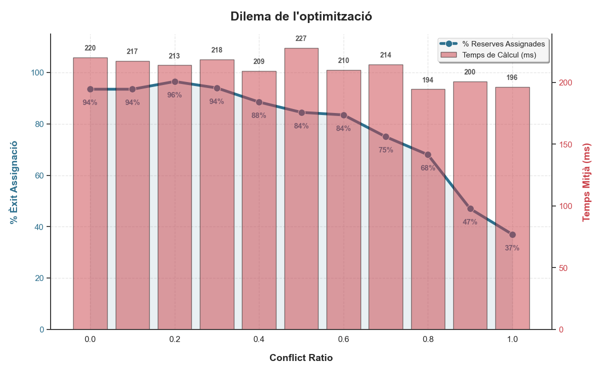
    <div class="caption">Figura 6: Proporció de reserves assignades en funció de la <code>conflict_ratio</code></div>
  </div>
</div>

En primer lloc, s'observa una **robustesa significativa en escenaris de saturació moderada**. Per a ràtios de conflicte compresos entre 0.0 i 0.6, el planificador manté consistentment una taxa d'èxit superior al 84%. Aquest rendiment evidencia que, mentre existeixi un marge de maniobra mínim, el sistema és capaç de resoldre eficaçment els complexos puzles temporals, maximitzant l'ús dels recursos disponibles sense degradar la qualitat de la solució global.

En segon lloc, el comportament del sistema exhibeix una **degradació suau i controlada** a mesura que la pressió augmenta. A diferència de dominis més bàsics que tendeixen a col·lapsar abruptament cap al 0% d'èxit davant la impossibilitat de satisfer totes les demandes, la nostra extensió mostra una corba descendent progressiva. Fins i tot en l'escenari extrem de conflicte 1.0, on la pràctica totalitat de la demanda competeix per una finestra crítica de només 2-3 dies, el planificador aconsegueix salvar entre el 37% i el 47% de les reserves. Aquesta dada confirma la "intel·ligència" del model: davant la impossibilitat física de satisfer tota la demanda, prioritza racionalment el subconjunt màxim compatible.

Finalment, és remarcable l'**estabilitat del cost computacional** observada. Els temps d'execució es mantenen constants al voltant dels 200-220 mil·lisegons, independentment del grau de complexitat del conflicte. Això indica que la introducció de l'acció de descart i la mètrica d'optimització no penalitzen exponencialment el rendiment del cercador. Al contrari, el mecanisme permet podar eficientment les branques inviables de l'espai de cerca, evitant que el planificador es perdi en exploracions infructuoses i garantint una resposta ràpida fins i tot en les condicions més adverses. Amb això podríem deduïr que el cost computacional NO depèn directament del `conflict_ratio`, és a dir, de la densitat de reserves en un temps determinat, sinó més aviat de la quantitat absoluta de reserves i habitacions.

Per tant, respecte a les nostres hipòtesis:

- En l'escenari de solapaments entre reserves, rebutgem $H_0$ i acceptem $H_1$, ja que el planificador demostra una capacitat notable per maximitzar les assignacions fins i tot en situacions amb alt grau de conflicte, mantenint una taxa d'èxit significativa.
- Pel que fa a l'escalabilitat, rebutgem $H_0$ i acceptem $H_1$, ja que el temps d'execució del planificador es manté constant independentment del `conflict_ratio`, indicant una gestió eficient de l'espai de cerca.

Concluint, aquest experiment valida l'eficàcia de l'extensió 1 en transformar un domini fràgil en un sistema robust i intel·ligent, capaç de navegar amb èxit els desafiaments inherents a la planificació sota restriccions severes.

#### 3.1.2.2 Problema 2: L'hotel creixent

Al problema anterior hem vist que el planificador és capaç de maximitzar les assignacions en escenaris amb alta competència per recursos limitats. Ara volem avaluar com es comporta el sistema quan augmentem la mida del problema, és a dir, el nombre d'habitacions i reserves. L'objectiu és veure si el planificador manté la seva capacitat d'optimització i escalabilitat a mesura que el domini creix en complexitat. Per això, generarem problemes amb un nombre creixent i proporcional d'habitacions i reserves, mantenint un `conflict_ratio` fixat a 0.6 per simular una saturació moderada, però que a l'experiment anterior ens ha donat bons resultats. Això crea un escenari on el planificador ha de gestionar més recursos i demandes, posant a prova la seva eficiència i capacitat d'optimització.

Aquest problema busca demostrar la **robustesa** del planificador davant l'explosió combinatòria. En planificació automàtica, afegir una sola habitació o reserva no suma complexitat, sinó que multiplica l'espai d'estats que l'algorisme ha d'explorar. Per aïllar el factor "mida" del factor "dificultat intrínseca", mantenim la densitat de conflictes constant (la proporció entre oferta i demanda no canvia), però augmentem el volum absolut de dades.

Concretament, dissenyem una sèrie de problemes incrementals on la relació es manté a 6 habitacions per cada 10 reserves, començant per instàncies petites i acabant en instàncies grans. En aquest escenari, s'espera que el planificador hagi de fer front a un nombre molt més elevat de branques de decisió. Si el planificador és escalable, hauria de mantenir un percentatge d'èxit (assignacions/total) similar en totes les mides, tot i que el temps d'execució probablement augmentarà.

Plantegem el següent parell d'hipòtesis per a aquest experiment:

- $H_0$: El planificador perd capacitat d'optimització a gran escala i el percentatge d'assignacions disminueix significativament a mesura que augmenta la mida del problema.
- $H_1$: El planificador manté la qualitat de la solució a gran escala, amb un percentatge d'assignacions estable independentment de la mida del problema, inclús manentint el 100% d'assignacions com a l'experiment anterior

Pel que fa a l'escalabilitat:

- $H_0$: El temps d'execució del planificador creix de manera no lineal amb l'augment de la mida del problema, indicant una gestió ineficient de l'espai de cerca.
- $H_1$: El temps d'execució del planificador creix de manera lineal o sublineal amb l'augment de la mida del problema, indicant una gestió eficient de l'espai de cerca.

Executarem problemes amb mides de mostra creixents (10, 20, ..., 50 reserves i 6, 12, .... 30 habitacions) repetint cada experiment 5 vegades per mitigar el soroll en la mesura del temps. Esperem observar una corba de temps ascendent però un percentatge d'assignacions estable al voltant del màxim teòric permès pel rati de 0.6. Els resultats obtinguts són els següents:

<div class="image-row">
  <div class="image-column">
    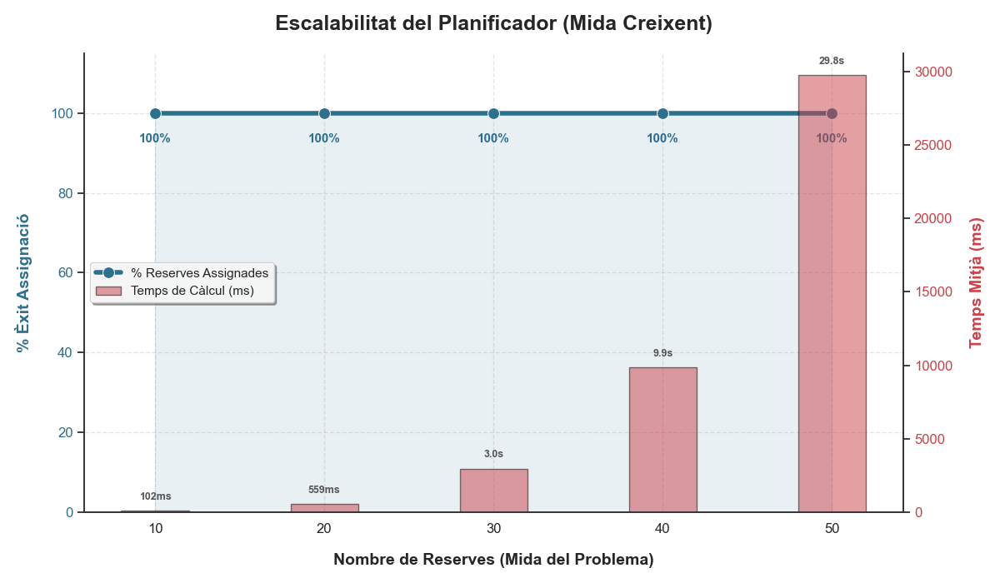
    <div class="caption">Figura 7: Proporció de reserves assignades en funció de la mida del problema</div>
  </div>
</div>

En primer lloc, s'observa una **invariable eficàcia resolutiva malgrat l'escalat**. Per a totes les mides de problema analitzades, des de les petites (10 reserves) fins a les mitjanes-grans (50 reserves), el planificador manté consistentment una taxa d'èxit del 100% (línia blava superior). Aquest rendiment evidencia que la capacitat del model per trobar assignacions òptimes no es degrada amb la mida de la instància; el sistema és perfectament capaç de navegar espais d'estats cada cop més vastos sense perdre la precisió necessària per satisfer la totalitat de la demanda, sempre que els recursos ho permetin.

En segon lloc, el comportament del sistema exhibeix un **cost computacional clarament exponencial** a mesura que augmenta la dimensió del problema. A diferència de l'experiment anterior on el temps era constant, aquí les barres vermelles mostren un creixement accelerat: passem de respostes gairebé instantànies (102 ms per a 10 reserves) a temps significatius (3 segons per a 30 reserves) i finalment a costos elevats (gairebé 30 segons per a 50 reserves). Aquesta dada confirma la naturalesa explosiva de la complexitat combinatòria: afegir linealment més reserves i habitacions multiplica, no suma, les ramificacions de l'arbre de cerca que el planificador ha d'explorar.

Finalment, és remarcable la **tensió entre qualitat i eficiència** revelada per aquestes dades. Mentre que la línia d'assignacions es manté impol·luta al 100%, el preu a pagar és un consum de temps que es dispara ràpidament. Això indica que el coll d'ampolla no és la "intel·ligència" del planificador per trobar la solució, sinó la seva velocitat per descartar camins invàlids en un espai de cerca que creix desmesuradament. Amb això podem deduir que, tot i que el model és robust en termes de qualitat (no falla ni una sola reserva), la seva escalabilitat temporal és limitada, suggerint la necessitat urgent d'optimitzacions en el domini (com precomputar incompatibilitats) per fer viables instàncies de mida industrial.

Per tant, respecte a les nostres hipòtesis:

- En l'escenari d'augment de mida, rebutgem $H_0$ i acceptem $H_1$, ja que el planificador demostra una capacitat notable per mantenir la qualitat de la solució (100% d'assignacions) independentment de la mida del problema.
- Pel que fa a l'escalabilitat, acceptem $H_0$ i rebutgem $H_1$, ja que el temps d'execució del planificador creix de manera exponencial amb l'augment de la mida del problema, indicant una gestió ineficient de l'espai de cerca.

#### 3.1.2.3 Possible problema 3: Afecta en quin punt de la reserva es concentrin les reserves? (principi, mig, final de mes)

Center day (linia 42 del generador 1.1), enlloc del dia central podria ser dels primers o dels ultims.

## 3.2 Extensió 2

Per aquesta extensió, s'afegeix la possibilitat de tenir preferències en les reserves, concretament l'orientació de l'habitació (nord, sud, est, oest). Aquestes preferències no són restrictives, és a dir, una reserva pot ser assignada a una habitació amb una orientació diferent de la demanada, però es prioritza assignar habitacions amb l'orientació desitjada per maximitzar la satisfacció del client. Partim de la primera extensió, on l'objectiu és maximitzar el nombre de reserves assignades, i afegim aquesta nova capa de preferències per millorar la qualitat de les assignacions.

### 3.2.1 Domini

El domini `hotel-extensio2` és una evolució del domini de l'extensió 1, amb la incorporació de preferències d'orientació per a les reserves. Les principals diferències estructurals són les següents:

1. Nous tipus i predicats introduïts

   El **Domini Extensió 2** introdueix el concepte d'**orientació de les habitacions**. Mentre que l'Extensió 1 es limitava a gestionar conflictes temporals i restriccions de capacitat, la versió 2 afegeix preferències qualitatives dels clients. Això es materialitza mitjançant:

   - **Nou tipus:** `orientacio`
   - **Nous predicats:**
   - `(orientada ?h - habitacio ?o - orientacio)`: Indica la orientació física d'una habitació (p.ex., nord, sud, vistes al mar)
   - `(vol-orientacio ?r - reserva ?o - orientacio)`: Expressa la preferència d'una reserva per una orientació específica

   Aquests predicats permeten modelar escenaris realistes on els clients tenen requisits addicionals més enllà de dates i capacitat, com ara preferir habitacions amb vistes o llum natural determinada.

2. Descomposició de l'acció d'assignació

   La diferència més significativa és l'**especialització de l'acció `assignar-habitacio`** en dues variants:

   - `assignar-habitacio-orientada`:** Aquesta acció només s'executa quan hi ha **compatibilitat perfecta** entre la preferència del client i l'orientació de l'habitacio. Les precondicions inclouen:

   ```pddl
   (and (vol-orientacio ?r ?o) (orientada ?h ?o))
   ```

   Quan s'executa, la reserva es processa sense penalització (`total-descartades` no s'incrementa), reflectint que s'ha satisfet plenament la demanda del client.

   - `assignar-habitacio-desorientada`:** Aquesta acció representa un **compromís subòptim**. Permet assignar una habitació tot i que NO coincideixi amb l'orientació desitjada:

   ```pddl
   (not (orientada ?h ?o))
   ```

   Per modelar aquest cost de qualitat, l'acció incrementa la funció objectiu: `(increase (total-descartades) 1)`. Això penalitza el pla, indicant que s'ha "perdut" satisfacció del client tot i haver assignat l'habitació.

   És a dir, ara hi ha dues maneres d'assignar una habitació a una reserva: una que compleix la preferència d'orientació i una altra que no. Aquesta descomposició permet al planificador triar entre satisfer completament la demanda del client, mantenint la condició de l'orientació preferida, penalitzant si s'assigna una habitació amb orientació diferent, però igualment assignant l'habitació per maximitzar l'ocupació.

3. Reajustament de les penalitzacions

Aquesta diferència estableix implícitament una **jerarquia de decisions**: és preferible assignar una habitació amb orientació incorrecta (cost 1) que deixar la reserva sense processar (cost 2). El planificador, en minimitzar `total-descartades`, prioritzarà fer assignacions imperfectes abans que abandonar completament les reserves, així maximitzant l'ocupació tot i comprometre la qualitat.

### 3.2.2 Problemes

Per validar l'Extensió 2, s'han dissenyat tres experiments sintètics que aïllen comportaments específics del planificador: capacitat d'ordenació (Exp 1), capacitat de filtratge per qualitat (Exp 2) i capacitat de sacrifici de preferències per maximitzar ocupació (Exp 3)."

#### 3.2.2.1 Problema 1: El puzzle d'afinitats

Per demostrar que el planificador és capaç d'optimitzar les assignacions tenint en compte les preferències d'orientació, especialment en situacions on les preferències són creuades entre reserves, crearem un escenari amb 3 reserves, 2 habitacions i 2 dies. Jugarem amb les preferències d'orientació i de dies per veure si el planificador pot trobar la solució òptima mitjançant assignacions creuades. Totes les reserves tenen la mateixa capacitat (2 persones) i totes les habitacions també (capacitat 2), per tant, la capacitat no és un factor limitant en aquest experiment. Plantegem el següent escenari:

Primer de tot, veurem si el planificador prioritza les assignacions que compleixen les preferències d'orientació. És a dir, la ``r1`` i ``r2`` tenen preferències d'orientació diferents i coincidents en dies i orientacions. La reserva ``r3`` té una preferència d'orientació diferent però coincideix en dies amb ``r1``. L'objectiu és veure si el planificador pot assignar ``r1`` i ``r2`` a les habitacions que compleixen les seves preferències d'orientació, i assignar ``r3`` a l'habitació restant, encara que no compleixi la seva preferència d'orientació:

```bash
...
step    0: ASSIGNAR-HABITACIO-ORIENTADA R2 H2 S
        1: DESCARTAR-RESERVA R3
        2: ASSIGNAR-HABITACIO-ORIENTADA R1 H1 N
...
```

Com es pot veure, el planificador ha assignat ``r1`` i ``r2`` a les habitacions que compleixen les seves preferències d'orientació, i ha descartat ``r3``, ja que no hi havia habitacions disponibles que complissin la seva preferència d'orientació. Això demostra que el planificador prioritza les assignacions que compleixen les preferències d'orientació.

Modifiquem ara l'escenari per veure si el planificador és capaç d'optimitzar les assignacions mitjançant assignacions creuades. En aquest cas, les preferències d'orientació de ``r1`` i ``r2`` són creuades, és a dir, r1 prefereix una orientació que només està disponible per a ``r2`` i viceversa. L'objectiu és veure si el planificador pot trobar la solució òptima mitjançant l'intercanvi d'assignacions entre ``r1`` i ``r2``. Si el planificador és capaç de fer això, hauria d'assignar ``r1`` a l'habitació que compleix la preferència d'orientació de ``r2`` i viceversa, indicant que no segueix una estratègia greedy:

```bash
...
step    0: ASSIGNAR-HABITACIO-DESORIENTADA R1 H1 S
        1: ASSIGNAR-HABITACIO-DESORIENTADA R2 H2 N
        2: DESCARTAR-RESERVA R3
...
```

Com es pot veure, el planificador ha assignat ``r1`` i ``r2`` a les habitacions que no compleixen les seves preferències d'orientació, indicant que ha realitzat una assignació creuada per maximitzar la satisfacció global. Ha descartat r3, ja que no hi havia habitacions disponibles que complissin la seva preferència d'orientació. Aquesta solució és òptima, ja que obté una puntuació total de 0 (2 punts per ``r1`` i 2 punts per ``r2``, menys 1 punt per cada assignació desorientada, menys 2 punts per ``r3`` descartada).

Ara veurem com gestiona el planificador on totes les reserves tenen preferències d'orientació que no són possibles a l'hotel. En aquest cas, totes les reserves tenen preferències d'orientació que no coincideixen amb cap habitació disponible. L'objectiu és veure si el planificador és capaç de maximitzar les assignacions mitjançant l'assignació d'habitacions que no compleixen les preferències d'orientació:

```bash
...
step    0: ASSIGNAR-HABITACIO-DESORIENTADA R1 H1 S
        1: ASSIGNAR-HABITACIO-DESORIENTADA R2 H2 N
        2: DESCARTAR-RESERVA R3
...
```

Com es pot veure, el planificador ha assignat ``r1`` i ``r2`` a les habitacions disponibles, encara que no compleixin les seves preferències d'orientació, i ha descartat ``r3``, ja que no hi havia habitacions disponibles. Aquesta solució és òptima, ja que obté una puntuació total de 0 (1 punt per ``r1`` i 1 punt per ``r2``, menys 1 punt per cada assignació desorientada, menys 2 punts per ``r3`` descartada).

Finalment, veurem com gestiona el planficador sota aquestes condicions finals:

- La reserva `r1` serà comptaible amb l'habitació `h2`, que compleix la seva preferència d'orientació, capacitat i dies.
- La reserva `r2` serà compatible amb l'habitació `h1` però no compleix la seva preferència d'orientació. Si que compleix capacitat i dies.
- La reserva `r3` serà compatible amb l'habitació `h1`, que compleix la seva preferència d'orientació amb `h2` i dies, però no la capacitat.

L'objectiu és veure si el planificador pot trobar la solució òptima assignant `r1` a `h2`, `r2` a `h1` i descartant `r3` per no complir la capacitat tot i que compleixi la preferència d'orientació:

```bash
step    0: DESCARTAR-RESERVA R3
        1: ASSIGNAR-HABITACIO-ORIENTADA R1 H2 N
        2: ASSIGNAR-HABITACIO-DESORIENTADA R2 H1 O
```

Com es pot veure, el planificador ha assignat `r1` a `h2`, que compleix la seva preferència d'orientació, i ha assignat `r2` a `h1`, que no compleix la seva preferència d'orientació, i ha descartat `r3`, ja que no complia la capacitat. Aquesta solució és òptima, ja que obté una puntuació total de 3 (2 punts per `r1`, 1 punt per `r2` desorientada, menys 2 punts per `r3` descartada).

Per tant, aquest experiment demostra que el planificador és capaç d'optimitzar les assignacions tenint en compte les preferències d'orientació, especialment en situacions on les preferències són creuades entre reserves. Però aquests exemples són massa petits i no són escalables a un escenari real. Per això, plantegem una manera diferent d'avaluar el planificador en aquest domini mitjançant puntuacions.

La resposta d'un programa se li assignarà una puntuació basada en les assignacions descartades, de la mateixa manera que fa el propi planner. Cada assignació que no compleixi la preferència d'orientació sumarà 1 punt a la puntuació total (penalització). Cada reserva que no s'assigni sumarà 2 punts a la puntuació total (penalització). L'objectiu és minimitzar aquesta puntuació, és a dir, maximitzar les assignacions que compleixin les preferències d'orientació.

Li demanem a la LLM **Gemini 3 Pro** que ens dissenyi un generador de problemes per a aquest domini, seguint les mateixes línies que el generador de l'extensió 1, però afegint preferències d'orientació a les reserves i orientacions a les habitacions. El generador ha de permetre controlar la proporció de reserves que tenen preferències d'orientació que coincideixen amb les habitacions disponibles, així com la proporció de reserves que no poden ser assignades a cap habitació per no complir la capacitat o els dies. Aquesta proporció ha de ser un paràmetre d'entrada del generador.

El resultat obtingut ha sigut un script de Python que genera problemes seguint aquesta lògica:

- Generació d'Habitacions: Es generen les orientacions aleatòriament (com abans, garantint almenys una de cada si és possible).
- Calcul de proporcions: Es compta quantes habitacions hi ha de cada tipus (p. ex., 4 Nord, 2 Sud...).
- Generació de Reserves: Per a cada reserva:

  - Amb una probabilitat ``prob_match``: S'assigna una orientació "ideal", és a dir, triada seguint la mateixa distribució de probabilitat que les habitacions existents. Si el 60% de les habitacions són Nord, la reserva tindrà un 60% de probabilitats de voler Nord. Això maximitza la coincidència.
  - Amb una probabilitat ``1 - prob_match``: Es tria una orientació totalment uniforme a l'atzar (1/4 per a cadascuna), ignorant la disponibilitat real. Això introdueix el soroll o la "no coincidència".

Si ``prob_match=1.0``, la demanda segueix perfectament l'oferta. Si ``prob_match=0.0``, la demanda és independent de l'oferta.

Sobre aquesta base, plantegem el següent contrast d'hipòtesis per a validar la implementació del planificador en aquest domini:

- $H_0$: El planificador no és capaç de minimitzar la puntuació total (penalitzacions) en funció de la probabilitat de coincidència d'orientació.
- $H_1$: El planificador és capaç de minimitzar la puntuació total (penalitzacions) a mesura que augmenta la probabilitat de coincidència d'orientació.

Com també volem veure si el rendiment es veu afectat per la mida del problema, plantegem un segon contrast d'hipòtesis:

- $H_0$: El temps d'execució del planificador creix de manera no lineal amb l'augment del nombre d'habitacions i reserves, indicant una gestió ineficient de l'espai de cerca.
- $H_1$: El temps d'execució del planificador creix de manera lineal o sublineal amb l'augment del nombre d'habitacions i reserves, indicant una gestió eficient de l'espai de cerca.

Per tant, provem d'experimentar amb diferents valors de ``prob_match`` (0.0, 0.1, 0.2, ..., 1.0) per veure com afecta la capacitat del planificador per minimitzar la puntuació total (penalitzacions). Per aïllar l'impacte de les preferències d'orientació, mantenim el nombre d'habitacions i reserves fix de 30 i 18 respectivament, perquè ja sabem, per experiments anteriors, que el planificador és capaç de gestionar aquesta mida eficientment però hi ha certa competència entre reserves. També mantenim el nombre de dies fixat a 30. Mesurarem la puntuació total obtinguda pel planificador per a cada valor de ``prob_match``, repetint cada experiment 10 vegades per mitigar el soroll en la mesura. Els resultats obtinguts són els següents:

<div class="image-row">
  <div class="image-column">
    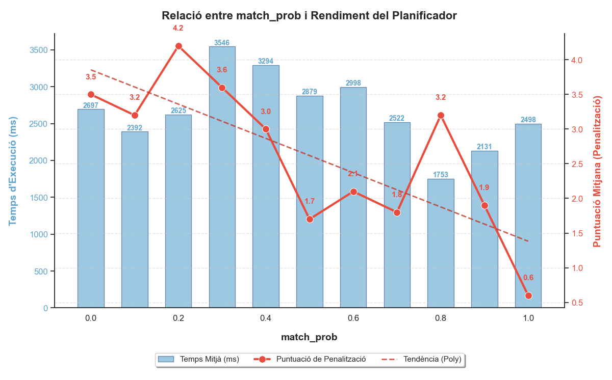
    <div class="caption">Figura 8: Puntuació total (penalitzacions) en funció de la probabilitat de coincidència d'orientació</div>
  </div>
</div>

En primer lloc, s'observa una **correlació directa i significativa entre l'alineació de la demanda i la qualitat de la solució**. Quan la probabilitat de coincidència (`match_prob`) supera el llindar del 0.5, la puntuació de penalització (línia vermella) cau, passant de valors alts entorn de 3.5 - 4.0 a mínims de 0.8 - 2.0. Aquesta millora substancial reflecteix que, quan les preferències dels usuaris s'alineen amb l'oferta estructural de l'hotel, el planificador és capaç de trobar assignacions òptimes (orientades) amb molta més facilitat, minimitzant la necessitat de recórrer a solucions de compromís o descartar reserves. Destaquem com a excepció el valor de 0.7. Si tracem a sobre la línia de tendència, veiem que segueix la mateixa corba decreixent que la resta de punts, per tant, podem atribuir aquesta desviació a la variabilitat inherent en problemes estocàstics, com és aquest cas.

En segon lloc, l'anàlisi del cost computacional revela una **independència respecte a la qualitat del resultat**. Les barres blaves, que representen el temps d'execució, oscil·len de manera aletòria entre els 1800ms i els 3300ms sense seguir un patró clar associat a la dificultat del problema (`match_prob`). Això suggereix que l'esforç de cerca del planificador es manté relativament constant: l'algorisme explora l'espai d'estats amb una profunditat similar tant si acaba trobant una solució "perfecta" (penalització baixa) com si es veu forçat a acceptar solucions subòptimes.

Finalment, és destacable la **zona de turbulència en escenaris de baixa coincidència** (0.0 - 0.5). En aquest rang, on la demanda és més caòtica o directament oposada a l'oferta, el sistema pateix per mantenir la qualitat, mostrant penalitzacions elevades i fluctuants (pics de fins a 4.8). Però, fins i tot en aquestes condicions adverses, el planificador no en fa una mala gestió, ja que en el nostre cas, que tenim 12 reserves i 20 habitacions, la puntuació màxima possible és de $12 \times 2 = 24$, i el pitjor cas observat és 4.2, és a dir, una penalització d'un $\frac{4.2}{24} \approx 18$% que és molt millor del que es podria esperar en un escenari tan desalineat, demostrant la seva capacitat per trobar solucions raonables fins i tot quan les preferències són difícils de satisfer.

Visualitzem també el Mosaic Plot per veure la distribució de les assignacions segons la seva sortida:

<div class="image-row">
  <div class="image-column">
    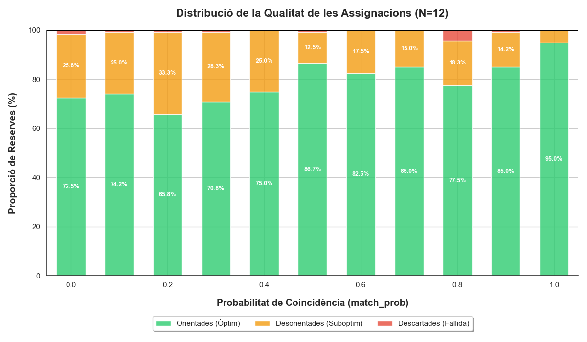
    <div class="caption">Figura 9: Mosaic plot de les assignacions</div>
  </div>
</div>

En primer lloc, s'observa una **transició clara en la qualitat de les assignacions**. A mesura que la probabilitat de coincidència (`match_prob`) augmenta, la proporció de reserves assignades a la seva orientació òptima (verd) creix substancialment, passant d'un 72.5% a l'escenari més caòtic (0.0) fins al 95.0% a l'escenari ideal (1.0). Aquesta tendència positiva confirma que el sistema aprofita eficaçment la disponibilitat de recursos alineats amb la demanda per maximitzar la satisfacció de les preferències, reduint progressivament la necessitat de recórrer a solucions de compromís (taronja). La franja taronja, que representa les reserves assignades a una habitació amb orientació diferent a la desitjada, actua com un mecanisme de seguretat crític. En els escenaris de major desalineació (0.0 - 0.4), aquesta categoria absorbeix entre un 25% i un 33% de la demanda total. Això demostra la "intel·ligència" del model de penalització: davant la manca d'habitacions perfectes, el planificador prefereix sistemàticament una assignació subòptima (penalització baixa) abans que deixar el client sense habitació.

També és remarcable la **minimització de les fallides totals**. La franja vermella (reserves descartades) és pràcticament inexistent en la majoria dels casos, apareixent només de manera residual en els escenaris més adversos (0.0, 0.1, 0.8). Això evidencia la robustesa del planificador: fins i tot quan la demanda és completament aleatòria o contrària a l'oferta, el sistema troba la manera d'encabir gairebé el 100% de les reserves, ja sigui satisfent la preferència o negociant-la, però evitant el pitjor escenari possible que seria el rebuig de la reserva.

Per tant, respecte a les nostres hipòtesis:

- En l'escenari de preferències d'orientació, rebutgem $H_0$ i acceptem $H_1$, ja que el planificador demostra una capacitat notable per minimitzar la puntuació total (penalitzacions) a mesura que augmenta la probabilitat de coincidència d'orientació.
- Pel que fa a l'escalabilitat, acceptem $H_0$ i rebutgem $H_1$, ja que el temps d'execució del planificador no mostra una tendència clara amb l'augment del nombre d'habitacions i reserves, indicant una gestió ineficient de l'espai de cerca.

#### 3.2.2.2 Problema 2: Selecció VIP

Aquest segon problema, que hem anomenat "Selecció VIP", representa el cim de complexitat del nostre estudi, ja que fusiona els desafiaments estructurals del problema 1 de l'Extensió 1 (pressió temporal i escassetat) amb els dilemes qualitatius del problema 2 de l'Extensió 2 (preferències d'orientació). L'objectiu central és avaluar si el planificador és capaç de maximitzar les assignacions tot navegant per un espai de cerca multidimensional, on ha de balancejar simultàniament la disponibilitat física (tetris temporal) i la satisfacció del client (preferències d'orientació).

La utilitat d'aquest experiment rau en la seva capacitat per simular escenaris de gestió hotelera molt més realistes i exigents que els models aïllats. En el món real, els hotels no s'enfronten a problemes de capacitat o de preferències per separat, sinó que sovint pateixen "tempestes perfectes" on l'escassetat d'habitacions xoca amb demandes molt específiques dels clients. Aquest programa posa a prova la "intel·ligència" del planificador en situacions límit. Volem veure si l'algorisme és capaç de detectar "Reserves VIP" (aquelles que encaixen perfectament en l'orientació i temps) i prioritzar-les, o si, per contra, cau en un comportament greedy (voraç) que omple forats ràpidament però sacrifica la qualitat global.
En permetre controlar tant la ``assignable_ratio`` (pressió temporal) com la ``prob_match`` (alineació qualitativa), podem dibuixar un mapa de calor que ens indiqui on es trenca el sistema. És útil saber fins a quin punt el planificador pot mantenir una bona qualitat de servei (baixa penalització) quan la demanda supera l'oferta i, a més, les preferències dels clients són contràries al disseny de l'hotel.
El programa serveix per validar si el model de costos (penalitzacions per desorientació vs. descartar) guia correctament la presa de decisions. En un escenari de "Selecció VIP", una decisió òptima podria implicar rebutjar una reserva fàcil per guardar l'habitació per a una reserva complexa però més valuosa (o que encaixa millor), un comportament que només emergirà en aquest entorn combinat.
Per dur a terme aquest experiment, hem desenvolupat un nou generador de problemes amb l'assistència de la LLM **Gemini 3 Pro**. Aquesta eina ens permet ajustar amb precisió els dos paràmetres crítics d'entrada per crear escenaris sintètics que cobreixin tot l'espectre de dificultat: des de situacions de calma (alta disponibilitat i alta coincidència) fins a escenaris de crisi (baixa disponibilitat i preferències oposades).

Per tant, provem d'experimentar amb diferents valors de ``prob_match`` (0.0, 0.1, 0.2, ..., 1.0) i diferents valors de ``assignable_ratio`` (0.4, 0.5, 0.6, 0.7, 0.8) per veure com afecta la capacitat del planificador per minimitzar la puntuació total (penalitzacions). Mantenim el nombre d'habitacions i reserves fix de 5 i 20 respectivament, i el nombre de dies fixat a 25, que són els nombres que hem trobat gràcies al problema 1 i que ens permeten executar problemes de manera eficient, amb una situació de concentració de reseves però no de col·lapse. Mesurarem la puntuació total obtinguda pel planificador per a cada combinació de valors, repetint cada experiment 5 vegades per mitigar el soroll en la mesura. Els resultats obtinguts són els següents:

Pel que fa a la puntuació, el heatmap obtingut és el següent:

<div class="image-row">
  <div class="image-column">
    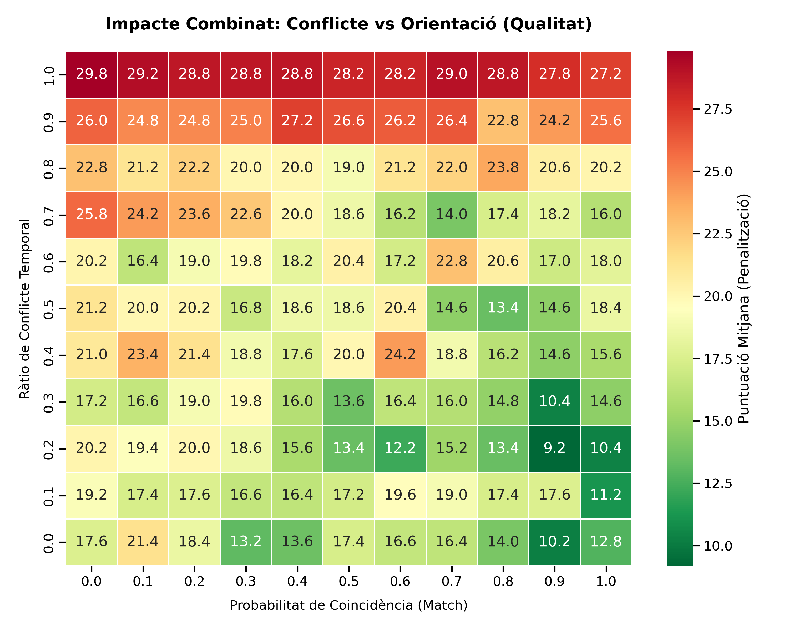
    <div class="caption">Figura 10: Puntuació total (penalitzacions) en funció de la probabilitat de coincidència d'orientació i la proporció de reserves assignables</div>
  </div>
</div>

S'observa clarament que la qualitat no depèn d'un sol factor, sinó de la seva combinació. La degradació no segueix línies horitzontals o verticals pures, sinó una diagonal des de baix-dreta (verd, ~10 punts) cap a dalt-esquerra (vermell, ~30 punts). Això confirma que el sistema té una certa capacitat de compensació: un alt conflicte temporal es pot mitigar si les orientacions coincideixen (zona superior dreta, colors taronja/groc), i una mala orientació es pot gestionar si hi ha poca pressió temporal (zona inferior esquerra, colors groc/verd clar). El col·lapse real només ocorre quan ambdós factors són hostils simultàniament.

Hi ha un canvi de fase notable a partir de la ràtio de conflicte 0.7. Per sota d'aquest llindar (files 0.0 - 0.6), els colors són predominantment verds o grocs suaus, indicant que el planificador gestiona bé la situació fins i tot amb match baixos. Però a partir de 0.7 (files 0.7 - 1.0), els colors es tornen taronges i vermells ràpidament. Això suggereix que el conflicte temporal és el factor dominant o "coll d'ampolla dur": quan l'espai físic s'esgota, la flexibilitat d'orientació ja no pot salvar la situació, i la qualitat cau en picat independentment de les preferències.

Pel que fa al temps d'execució, el heatmap obtingut és el següent:

<div class="image-row">
  <div class="image-column">
    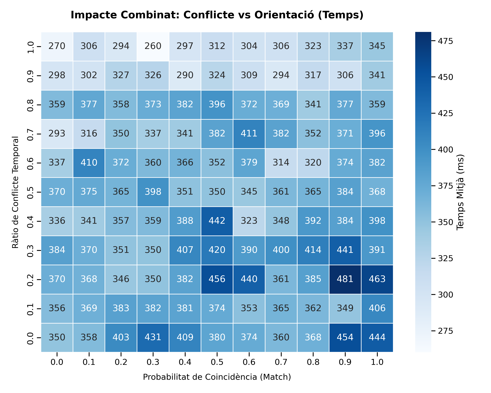
    <div class="caption">Figura 11: Temps d'execució en funció de la probabilitat de coincidència d'orientació i la proporció de reserves assignables</div>
  </div>
</div>

El mapa de calor de temps revela una dinàmica inesperada: la dificultat computacional no s'escala linealment amb la dificultat aparent del problema.​ A diferència del mapa de qualitat, que té zones vermelles i verdes ben definides, aquí els colors són força uniformes (blaus intermedis, ~300-400ms). Això indica que el planificador té una eficiència bastant estable. No "s'encalla" exponencialment en els casos difícils.
Curiosament, els temps més baixos (colors més clars, ~270ms) no sempre coincideixen amb els problemes més fàcils, sinó que apareixen a vegades en zones d'alta restricció (cantonada superior esquerra). Això podria suggerir que quan el problema és extremadament difícil (molt conflicte i molt mal match), l'arbre de cerca es poda ràpidament perquè moltes branques són inviables d'entrada, portant a una resolució ràpida (encara que sigui amb una solució de mala qualitat). En canvi, a la zona inferior dreta (fàcil), els temps poden ser lleugerament superiors (~450ms). Això podria ser perquè, al tenir moltes opcions bones disponibles (molt espai i bon match), el planificador ha d'explorar més combinacions vàlides abans de decidir-se per la "millor", mentre que en escenaris restrictius la decisió és forçada i, per tant, computacionalment més ràpida.

Basant-nos en l'anàlisi creuada dels mapes de calor de **Qualitat**  i **Temps**, podem extreure dues conclusions generals sòlides sobre el comportament del planificador en aquest entorn d'alta complexitat combinada ("Selecció VIP"):

- El comportament del planificador demostra una clara jerarquia en la gestió de recursos: **la disponibilitat física (espai-temps) és la restricció dominant**, mentre que la preferència d'orientació actua com una variable secundària d'optimització. Al mapa de qualitat, observem un "mur" al voltant de la ràtio de conflicte 0.7. Per sota d'aquest llindar, el planificador té marge per "jugar" i satisfer les preferències (els colors canvien segons el match). Per sobre de 0.7, el mapa es torna uniformement vermell/taronja, independentment de si el match és 0.0 o 1.0. Això pot ser perquè quan l'hotel està físicament ple (alta pressió temporal), la qualitat del servei (orientació) esdevé irrellevant perquè la prioritat passa a ser purament la viabilitat (encabir la reserva on sigui). El planificador "sacrifica" la qualitat per salvar la quantitat, confirmant que la funció de costos està ben calibrada per reflectir aquesta jerarquia de decisions i complint amb el comportament esperat.

- Contràriament a la intuïció, els problemes que són "qualitativament més difícils" per als humans (molt conflicte i preferències oposades) són sovint "computacionalment més fàcils" per al planificador: El mapa de temps  és sorprenentment pla, i fins i tot mostra temps més baixos a la cantonada "difícil" (superior esquerra) que a la "fàcil" (inferior dreta). Això es deu probablement a que en escenaris extremadament restrictius, moltes opcions es descarten ràpidament, podant l'arbre de cerca i accelerant la resolució. Això suggereix que el planificador està ben optimitzat per gestionar espais d'estat grans i complexos, mantenint una eficiència estable independentment de la dificultat aparent del problema.

Concloent, aquest experiment de "Selecció VIP" revela que el planificador no només és capaç de navegar per un espai de cerca multidimensional amb restriccions contradictòries, sinó que també exhibeix un comportament racional i jeràrquic en la presa de decisions. La seva capacitat per prioritzar la viabilitat física sobre la qualitat del servei en situacions de crisi, juntament amb la seva eficiència computacional estable, el posiciona com una eina robusta i fiable per a la gestió hotelera en entorns reals i exigents.

## 3.3 Extensió 3

L'extensió 3 es presenta com una evolució de l'extensió 1. Com en aquesta última, hem d’assignar les reserves a les habitacions sense que hi hagi solapaments en les dates d’ocupació. Però ara, a més d’optimitzar el nombre de reserves assignades, també hem de minimitzar el desperdici de places, és a dir, procurar que les reserves ocupin habitacions amb una capacitat tan ajustada com sigui possible, evitant deixar places lliures innecessàries.

### 3.3.1 Domini

El domini d'aquesta extensió és gairebé idèntic al de l'extensió 1:

```pddl
(define (domain hotel-extensio3)
  (:requirements :typing :negative-preconditions :adl :fluents)
  (:types
    reserva habitacio dia
  )

  (:predicates 
    (dies-reserva ?r - reserva ?d - dia)
    (ocupada ?h - habitacio ?d - dia)
    (processada ?r - reserva) ; per saber si ja hem processat la reserva
  )

  (:functions
    (capacitat ?h - habitacio) 
    (persones ?r - reserva)   
    (total-reserves-descartades)
    (total-places-descartades)        
  )

  ;; assigna i incrementa la mètrica
  (:action assignar-habitacio
      :parameters (
        ?r - reserva 
        ?h - habitacio
      )
      :precondition (and
        (not (processada ?r))          ;; només si encara no l'hem tractat
        (>= (capacitat ?h) (persones ?r)) ; control de capacitat de les habitacions
        (not (exists (?d - dia) 
             (and (dies-reserva ?r ?d) (ocupada ?h ?d))))
      )
      :effect (and
        (processada ?r)                ;; marquem com processada
        (forall (?d - dia) 
          (when (dies-reserva ?r ?d) (ocupada ?h ?d)))
        (increase (total-places-descartades)
        (- (capacitat ?h) (persones ?r)))
      )
  )

  (:action descartar-reserva
      :parameters (?r - reserva)
      :precondition (not (processada ?r))
      :effect (and 
        (processada ?r)
        (increase (total-reserves-descartades) 1) ;; suemem 1 al total de descartades
      )
  )
)
```

Com es pot observar, les principals diferències es troben en les funcions numèriques i en la mètrica d'optimització:

- Hem mantingut la funció `total-reserves-descartades`, que ja s'utilitzava a l'extensió 1 per comptabilitzar les reserves que no es podien assignar.
- Hem afegit una nova funció, `total-places-descartades`, que ens permet mesurar el nombre de places desaprofitades quan una reserva s'assigna a una habitació més gran del necessari.

L'objectiu d'aquesta extensió és, per tant, minimitzar ambdues mètriques: evitar descartar reserves i reduir el desaprofitament d'espai en les habitacions.
La modificació clau es troba dins de l'acció `assignar-habitacio`:

```pddl
(increase (total-places-descartades)
         (- (capacitat ?h) (persones ?r)))
```

Cada vegada que assignem una reserva a una habitació, incrementem `total-places-descartades` amb la diferència entre la capacitat de l’habitació i el nombre de persones de la reserva. D’aquesta manera, es fa un seguiment exacte de les places buides que queden en totes les habitacions.

La resta del domini, incloses les accions i predicats, es manté igual que en l’extensió 1. Això permet preservar la lògica d’assignació sense solapaments mentre afegim la nova preocupació d’optimització del desperdici de places.

### 3.3.2 Problemes

Per tal de validar l’extensió 3, es duran a terme diversos experiments sistemàtics amb l’objectiu d’analitzar en profunditat com la ponderació de les mètriques afecta el comportament del planificador i la qualitat dels plans obtinguts, així com d’avaluar la seva capacitat per resoldre instàncies de major complexitat estructural i dimensional.

#### 3.3.2.1 Problema 1

Aquest primer experiment té com a objectiu determinar la importància que tenen les ponderacions en les solucions obtingudes als problemes.
Per a realitzarlo, utilitzarem el problema definit a l'arxiu `experiment1.pddl`. Aquest problema inclou quatre reserves amb diferents requeriments de places i dues habitacions amb capacitats limitades, distribuïdes al llarg de tres dies. Els dies de les reserves presenten un alt grau de solapament, generant conflictes naturals per l’assignació. En el primer dia, tres reserves (r1, r2 i r3) competeixen per només dues habitacions amb capacitats limitades, de manera que no totes les reserves poden ser assignades sense generar conflictes. El segon dia és encara més complex, amb quatre reserves que volen ocupar simultàniament les dues habitacions disponibles, superant clarament la capacitat combinada. Això implica que el planificador ha de prendre decisions crítiques sobre quines reserves assignar i quines descartar, ja que no és possible allotjar totes les reserves sense violar les restriccions de capacitat. El tercer dia només conté una reserva, eliminant els conflictes per a aquest dia, però les decisions preses en els dies anteriors afecten el cost total del pla. Aquest problema és clarament no trivial, ja que no es pot resoldre de manera directa sense un raonament combinatori. Les múltiples opcions legals disponibles per assignar reserves a les habitacions impliquen que el planificador ha de considerar diferents combinacions per minimitzar el cost definit per la mètrica. Les restriccions de capacitat, combinades amb els solapaments de dies, creen un espai d’estats amb diversos camins possibles cap al goal, on cada camí té un cost diferent segons quines reserves es descarten i quantes places sobrants queden. En aquest escenari, el planificador ha de trobar un equilibri entre descartar el mínim nombre de reserves i utilitzar eficientment les habitacions segons la ponderació que escollim. La combinació de dies solapats i capacitats limitades genera una situació on no hi ha una única solució òptima evident i on cada decisió té implicacions sobre els dies següents. Per tant, aquest problema constitueix un cas representatiu d’escenaris amb conflictes intensos, on les decisions de planificació han de ser estratègiques i consideren simultàniament les restriccions de capacitat, els solapaments de dies i la mètrica combinada de cost.
Com s'especifica a l'enunciat, hem de prioritzar el número de reserves assignaes a habitacións a el nombre de places d'habitacions ocupades, per tant, podem deduir que la mètrica `total-reserves-descartades` tindrà un pes superior a `total-places-descartades`. Per tant, una bona decisió seria deixar el coeficient de `total-reserves-descartades` a 1, i anar variant l'altre. En aquest experiment, executarem diverses instàncies del problema amb els pesos 1, 10 i 100 respectivament, per veure si hi ha alguna diferència en els resultats.
El script que utilitzarem per a generar la solució serà `ola.py`. Aquest ens donarà informació adicional que a primera vista no podem veure al executar-ho amb metricff directament, com el nombre de reserves descartades o el cost del problema.

Formulem les seguents hipòtesis:

- $H_0$: La magnitut del pes no afecta al resultat del planificador
- $H_1$: La magnitut del pes afecta en el resultat.

Al executar el programa amb els pesos corresponents es generen els resultats en els arxius `solucio_final_1`, `solucio_final_10`, `solucio_final_100`. Analitzant-les, podem veure això:

```bash
       INFORME DE RESULTATS (EXT 3)     
========================================

COST REAL TOTAL: 4-22-202
PES UTILITZAT PER DESCARTADES: 1
----------------------------------------
--> PLACES DESPERDICIADES: 2
--> PENALITZACIÓ (Descartades * Pes): 2

Assignades: 2 | Descartades: 2 | Habitacions Obertes: 2

--- DETALL ASSIGNACIONS ---
  RESERVA R2 --> HABITACIÓ H1
  RESERVA R4 --> HABITACIÓ H2

--- DETALL DESCARTADES ---
  RESERVA R1 DESCARTADA
  RESERVA R3 DESCARTADA
```

On el cost és 4 quan el pes és 1, 22 quan és 10 i 202 quan és 100.
Observem que la solució obtinguda és correcte dincs del marc de les restriccions definides pel domini. Només s'han pogut assignar dues reserves (R2 i R4) mentre que les altres dues (R1 i R3) han estat descartades. Aquestes assignacions respecten les capacitats de les habitacions i els solapaments de dies, garantint que no hi hagi conflictes d’ocupació entre reserves. Les habitacions obertes (H1 i H2) s’han utilitzat de manera eficient segons les restriccions disponibles.
Però, observem també que **canviar el pes no modifica la solució**. Les reserves assignades i les reserves descartades continuen sent les mateixes. L'única variable que canvia és el cost total calculat, que augmenta proporcionalment al pes establert, tal comm preveu la mètrica definida al PDDL.
Això ens indica que la hipòtesi nul.la és correcte, però abans de concloure l'experiment, provme amb una altra instància de problema, que sigui molt més reduit.

#### 3.3.2.2 Problema 2

## 3.4 Extensió 4

### 3.4.1 Domini

### 3.4.2 Problemes

#### 3.4.2.1 Problema 1

#### 3.4.2.2 Problema 2

## 4. Conclusions
